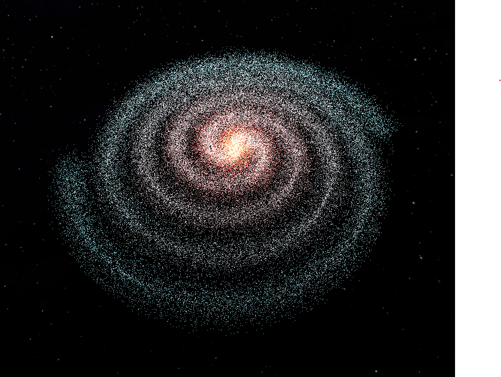

# First step into Galaxy

Basic Three.js project representing a rotating galaxy made with points.  
Colors are different from the center to the branches.  
For a better distribution of the points (Gaussian) and a nicer sparkling visual, go to https://github.com/Tolexia/threejs-galaxy-v3 (v2 is not stable).  

[Live Demo Here](https://tolexia.github.io/threejs-galaxy/dist/index.html)

## Preview 

